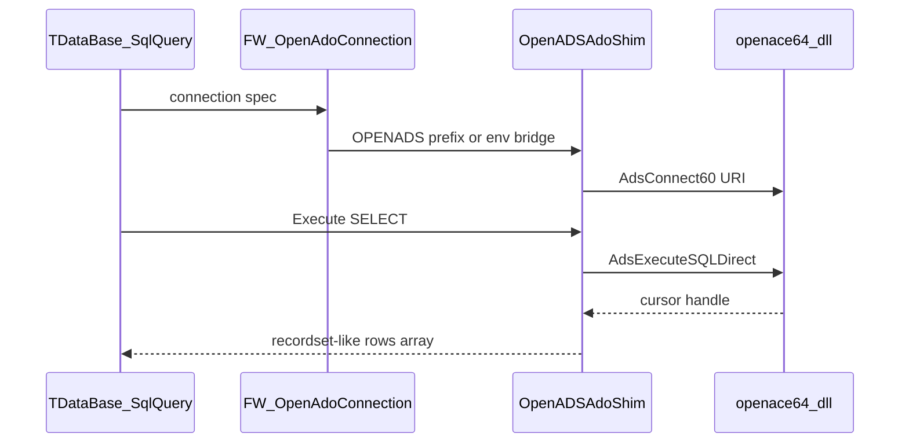

# RFC: ADO bridge for FiveWin `TDataBase:SqlQuery`

**Status:** v1 shim in `tools/fwh_patch/` (patch + `openads_ado_bridge.prg`)  
**Target:** Class B apps (`fwsqlcmd.ch`, `adofuncs.prg`, `TDataBase:SqlQuery`)  
**Goal:** route SQL through OpenADS `AdsExecuteSQLDirect` without rewriting
business `.prg` files.

## Problem

`TDataBase:SqlQuery` in FWH `database.prg` (~line 2214) opens a COM object:

```xbase
oCn := TOleAuto():New( "ADODB.Connection" )
oRs := FW_OpenRecordSet( ::oCn, cSql, 1 )
```

This path never loads `openace64.dll` semantics for SQL — it talks to whatever
OLE DB/ADO provider is configured (SQL Server, MySQL ODBC, etc.).

Class A apps (`USE ADSCDX`, `rddads`) already work with `openace64.dll` alone.
Class B needs an explicit bridge.

## Proposed activation

| Mechanism | When |
|-----------|------|
| Connection spec prefix `OPENADS,` | `FW_OpenAdoConnection( "OPENADS,mariadb://user@host/db" )` |
| Env `OPENADS_ADO_BRIDGE=1` | Global: all `FW_OpenAdoConnection` calls delegate to ACE |
| Env `OPENADS_CONNECT_URI` | Shared default URI (same as N2 auto-connect) |

## Architecture



## API mapping

| ADO surface (FWH) | OpenADS ACE |
|-------------------|-------------|
| `Connection.Open` | `AdsConnect60(uri, …)` |
| `Connection.Execute` (non-query) | `AdsExecuteSQLDirect` → no cursor |
| `Recordset` from SELECT | `AdsExecuteSQLDirect` → cursor; `AdsFetch` loop |
| `RecordCount` | `AdsGetRecordCount` on cursor |
| `GetRows` / `RsGetRows` | Batch fetch via `AdsGetField` per column |
| `Close` | `AdsCloseTable` / cursor teardown |

## Connection string format

```
OPENADS,<uri>[,user][,password]

Examples:
  OPENADS,mariadb://root@127.0.0.1:3306/test
  OPENADS,tcp://127.0.0.1:6262/mydata
  OPENADS,.                          ; uses OPENADS_DATA_DIR or CWD
```

Array form (existing FWH idiom) maps the first element to `OPENADS` and the
second to the URI.

## Error handling

- Map `AdsGetLastError` → FWH `FW_ShowAdoError`-compatible structure when
  `lShowError` is set.
- On missing Plus feature (`AE_FUNCTION_NOT_AVAILABLE`), fall back to real ADO
  only if the spec does not start with `OPENADS,` (no silent downgrade for
  explicit OpenADS specs).

## Implementation phases

1. **Shim library** (`openads_ado.prg` or FWH patch): subclass / replace
   `FW_OpenAdoConnection` when bridge env is set.
2. **Cursor → array**: reuse `RsGetRows` layout so `SqlQuery` return shape is
   unchanged (`{ col1, col2, … }` per row).
3. **Sample:** extend `examples/fivewin/` with a `SqlQuery` demo against
   `mariadb://` via bridge.
4. **Optional FWH upstream:** FiveTech contribution once stable.

## Non-goals (v1)

- Full ADO COM compatibility for arbitrary providers.
- `fwsqlcmd.ch` preprocessor changes (compile-time SQL already produces strings
  — bridge only needs `Execute` on the final string).
- ODBC RDD (`TRddOdbc`) interception.

## Dependencies

- `OPENADS_CONNECT_URI` / `AdsConnect60` for session establishment.
- `AdsExecuteSQLDirect` SQL parser for DDL/DML passthrough where enabled.
- Plus backends: read + SEEK + basic write (append/update/delete) since `2f58a90`.

## Test plan

1. Unit: bridge parses `OPENADS,` specs and calls `AdsConnect60` once (singleton).
2. Integration: `TDataBase:SqlQuery( "SELECT …" )` against local DBF via ACE SQL.
3. Integration: same against `mariadb://` when server available; SKIP in CI otherwise.
4. Regression: without bridge env, native ADO path unchanged.